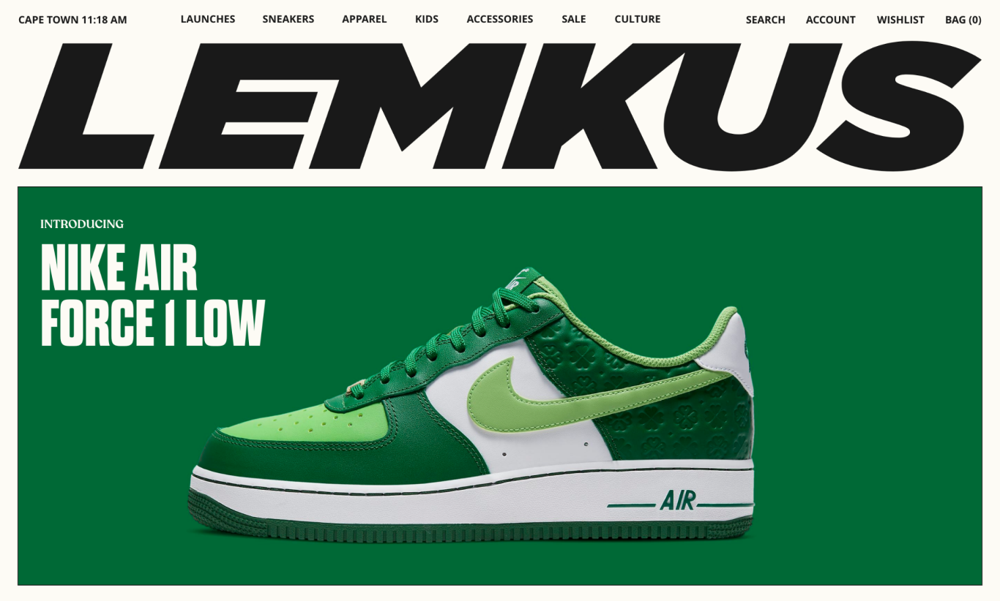

## Time: 42h00
Data: 08:15  | 05.18  
Daily: -4:00  
  
 (https://github.com/Efetivos/gesch)


### Colors:
-  `#191919`
-  `#f6f6f6`
-  `#fdfbf5`
-  `#ffffff`
-  `#fec333`
-  `#e6cac6`

###	 Infos site
```bash 

\:root
	--gap: 2.5rem
	--dark: #191919
	--gray: #f6f6f6
	--soft: #fdfbf5
	--white: #ffffff
	--color: #fec333
	--pink: #e6cac6
	--dharma: 'DharmaGothicE-Bold', condensed, sans-serif
	--dharmaex: 'DharmaGothicE-ExBold', condensed, sans-serif
	--sans: 'OpenSans-Regular', sans-serif
	--openbold: 'OpenSans-Bold', sans-serif
	--opensemi: 'OpenSans-SemiBold', sans-serif
	--reco: 'RecoletaAlt-Regular', serif
	--recosemi: 'RecoletaAlt-SemiBold', serif
	--recomed: 'RecoletaAlt-Medium', serif
	--serif: 'RecoletaAlt-Regular', serif
	@include desk
		--gap: 2.5rem


@mixin dharma
	font-family: var(--dharma)
@mixin dharmaex
	font-family: var(--dharmaex)
@mixin sans
	font-family: var(--sans)
@mixin openbold
	font-family: var(--openbold)
@mixin opensemi
	font-family: var(--opensemi)
@mixin reco
	font-family: var(--reco)
@mixin recosemi
	font-family: var(--recosemi)
@mixin recomed
	font-family: var(--recomed)
@mixin serif
	font-family: var(--serif)


.dharma
	font-family: var(--dharma)
.dharmaex
	font-family: var(--dharmaex)
.sans
	font-family: var(--sans)
.openbold
	font-family: var(--openbold)
.opensemi
	font-family: var(--opensemi)
.reco
	font-family: var(--reco)
.recosemi
	font-family: var(--recosemi)
.recomed
	font-family: var(--recomed)
.serif
	font-family: var(--serif)


```

#### Pages Templates
<ul>
	<li>Home</li>
	<li>Contact</li>
	<li>Shop</li>
	<li>Product</li>
	<li>Blog</li>
	<li>Article</li>
	<li>About</li>
	<li>Search Result</li>
</ul>

#### Pages Customers
<ul>
	<li>Login</li>
	<li>Register</li>
	<li>Account</li>
	<li>Account Informations</li>
	<li>Order Details</li>
	<li>Reset Password (Extra) </li>
</ul>


#### Elements
<ul>
	<li>Menu DropDown</li>
	<li>Launches</li>
	<li>Blog Menu / FS</li>
	<li>Mini Cart / WishList</li>
</ul>
